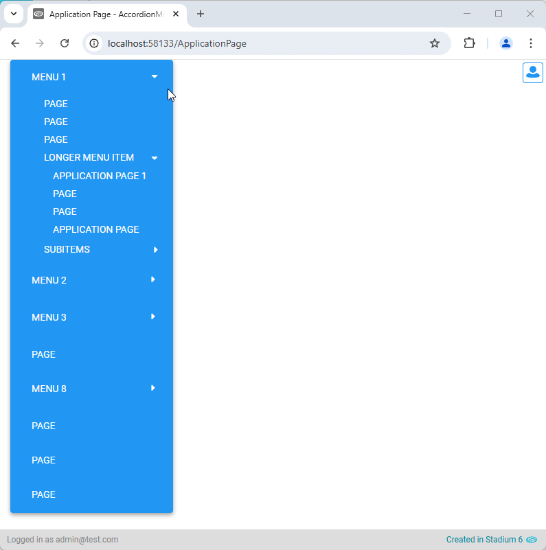
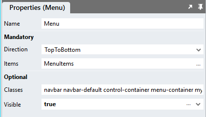

# Accordion Menu <!-- omit in toc -->

Display the dropdown menu control as an accorion menu. This module works when your menu display direction is set to "TopToBottom" and when the menu is not very deep. 



# Version
1.0

1.0.1 Various CSS adjustments and fixes

# Setup

## Application Setup
1. Check the *Enable Style Sheet* checkbox in the application properties

## Global Script
1. Create a Global Script called "AccordionMenu"
2. Add the input parameters below to the Global Script
   1. MenuClass
   2. OpenMultiple
   3. OpenParent
3. Drag a *JavaScript* action into the script
4. Add the Javascript below into the JavaScript code property
```javascript
/* Stadium Script v1.0 https://github.com/stadium-software/accordion-menu */
let scope = this;
let openMultiple = ~.Parameters.Input.OpenMultiple;
if (openMultiple !== true && openMultiple !== "true") {
    openMultiple = false;
}
let showSelected = ~.Parameters.Input.OpenParent;
if (showSelected !== false && showSelected !== "false") {
    showSelected = true;
}
let menuClass = ~.Parameters.Input.MenuClass;
let menuEl = document.querySelectorAll("." + menuClass + ".menu-container");
if (menuEl.length == 0) {
    console.error("No menu found with class: " + menuClass);
} else if (menuEl.length > 1) {
    console.error("Multiple menus found with class: '" + menuClass + "'. Please use a unique class for each menu.");
}
menuEl = menuEl[0];
let menus = menuEl.querySelectorAll(".dropdown > a, .dropdown-submenu > a");
for (let i=0;i<menus.length;i++) {
    createMenuToggleEvent(menus[i]);
}
if (showSelected) openSelected();
function createMenuToggleEvent(menu) {
	menu.addEventListener("click", function(e) {
        let target = e.target;
        let menu = target.closest(".dropdown, .dropdown-submenu");
        if (menu.classList.contains("dropdown") && !menu.classList.contains("show") && !openMultiple) {
            closeAllMenus(menu);
        }
        if (menu.classList.contains("dropdown-submenu") && !menu.classList.contains("show") && !openMultiple) {
            closeSiblings(menu);
        }
        if (menu) menu.classList.toggle("show");
        if (!menu.classList.contains("show")) closeSubmenus(menu);
    });
}
function closeSiblings(menu) {
    let siblingmenus = menu.closest(".dropdown-menu").querySelectorAll(".dropdown-submenu");
    for (let i=0;i<siblingmenus.length;i++) {
        if (menu === siblingmenus[i]) continue;
        siblingmenus[i].classList.remove("show");
    }
}
function closeSubmenus(parentMenu) {
    let submenus = parentMenu.querySelectorAll(".dropdown-submenu");
    for (let i=0;i<submenus.length;i++) {
        submenus[i].classList.remove("show");
    }
}
function closeAllMenus() {
    let menus = menuEl.querySelectorAll(".dropdown, .dropdown-submenu");
    for (let i=0;i<menus.length;i++) {
        menus[i].classList.remove("show");
    }
}
function openSelected() {
    let arrPageName = window.location.pathname.split("/");
    let pageName = arrPageName[arrPageName.length - 1];
    let array = dmGet(menuEl, "Items");
    let findItemNested = (arr, itemId, nestingKey) => (
      arr.reduce((a, item) => {
        if (a) return a;
        if (item.url === itemId) return item;
        if (item[nestingKey]) return findItemNested(item[nestingKey], itemId, nestingKey);
      }, null)
    );
    let ob = findItemNested(array, "/" + pageName, "items");
    let menuitemtext = menuEl.querySelectorAll("li > a > span");
      for (let i=0;i<menuitemtext.length;i++) {
          if (menuitemtext[i].textContent === ob.text) {
            let elem = menuitemtext[i].closest("li");
            for (; elem && elem !== document; elem = elem.parentNode) {
                if (elem.classList.contains("dropdown") || elem.classList.contains("dropdown-submenu")) elem.classList.add("show");
            }
            break;
        }
    }
}
function dmGet(control, p){
    let getObjectName = (obj) => {
        let objname = obj.id.replace("-container","");
        do {
            let arrNameParts = objname.split(/_(.*)/s);
            objname = arrNameParts[1];
        } while ((objname.match(/_/g) || []).length > 0 && !scope[`${objname}Classes`]);
        return objname;
    };
    function getDMValues(ob, property) {
        let obname = getObjectName(ob);
        return scope[`${obname}${property}`];
    }
    return getDMValues(control, p);
}
```

## Page
1. Add a menu control to yoru page and set the *Direction* property to "TopToBottom"
2. Add a unique class to the menu control *classes* property (e.g. stadium-accordion-menu)



## Page.Load
1. Drag the global script called "AccordionMenu" into the *Page.Load* event
2. Add the input parameters below to the *Page.Load* event
   1. MenuClass: The unique class you added to the menu control (e.g. stadium-accordion-menu)
   2. OpenMultiple: Set to true if you want to allow opening multiple menus at once (default is false)
   3. OpenParent: Set to false if you don't want the parent menu of the current page to be opened when the page loads (default is true)

## CSS
The CSS below is required for the correct functioning of the module. Variables exposed in the [*accordion-menu-variables.css*](accordion-menu-variables.css) file can be [customised](#customising-css).

### Before v6.12
1. Create a folder called "CSS" inside of your Embedded Files in your application
2. Drag the two CSS files from this repo [*accordion-menu-variables.css*](accordion-menu-variables.css) and [*accordion-menu.css*](accordion-menu.css) into that folder
3. Paste the link tags below into the *head* property of your application
```html
<link rel="stylesheet" href="{EmbeddedFiles}/CSS/accordion-menu.css">
<link rel="stylesheet" href="{EmbeddedFiles}/CSS/accordion-menu-variables.css">
``` 

### v6.12+
1. Create a folder called "CSS" inside of your Embedded Files in your application
2. Drag the CSS files from this repo [*accordion-menu.css*](accordion-menu.css) into that folder
3. Paste the link tag below into the *head* property of your application
```html
<link rel="stylesheet" href="{EmbeddedFiles}/CSS/accordion-menu.css">
``` 

### Customising CSS
1. Open the CSS file called [*accordion-menu-variables.css*](accordion-menu-variables.css) from this repo
2. Adjust the variables in the *:root* element as you see fit
3. Stadium 6.12+ users can comment out any variable they do **not** want to customise
4. Add the [*accordion-menu-variables.css*](accordion-menu-variables.css) to the "CSS" folder in the EmbeddedFiles (overwrite)
5. Paste the link tag below into the *head* property of your application (if you don't already have it there)
```html
<link rel="stylesheet" href="{EmbeddedFiles}/CSS/accordion-menu-variables.css">
``` 
6. Add the file to the "CSS" inside of your Embedded Files in your application

**NOTE: Do not change any of the CSS in the 'accordion-menu.css' file**

## Upgrading Stadium Repos
Stadium Repos are not static. They change as additional features are added and bugs are fixed. Using the right method to work with Stadium Repos allows for upgrading them in a controlled manner. 

How to use and update application repos is described here: [Working with Stadium Repos](https://github.com/stadium-software/samples-upgrading)